# Cards yet to be Implemented
The images below show cards that are _**not yet**_ implemented. If you are having issues with a card that is not on the list, please reach out in the discord or create a github issue.

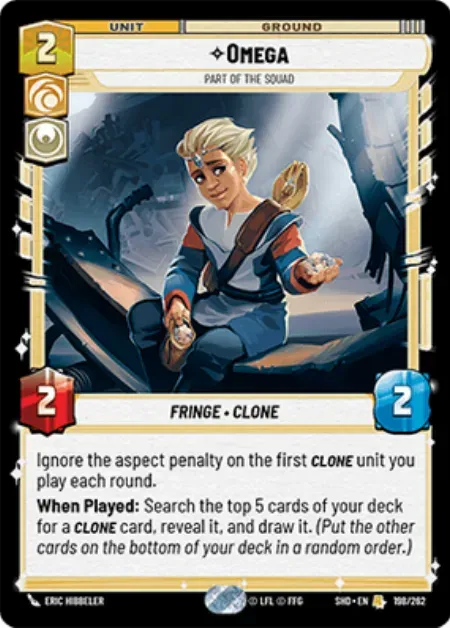
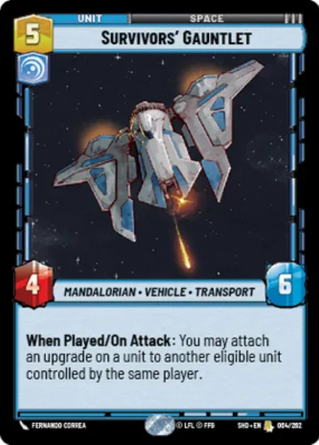

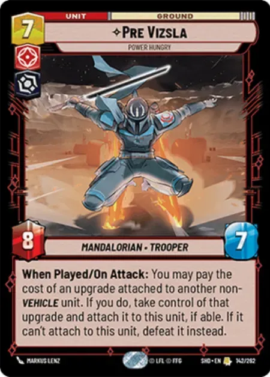

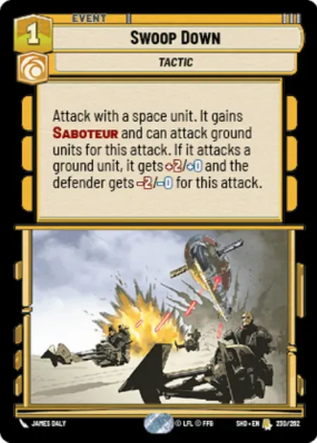
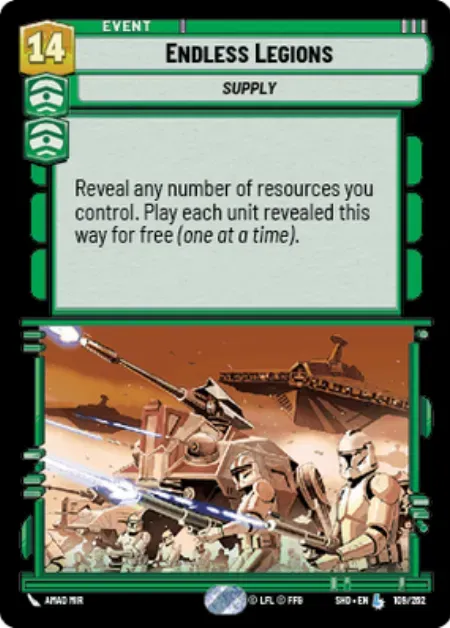

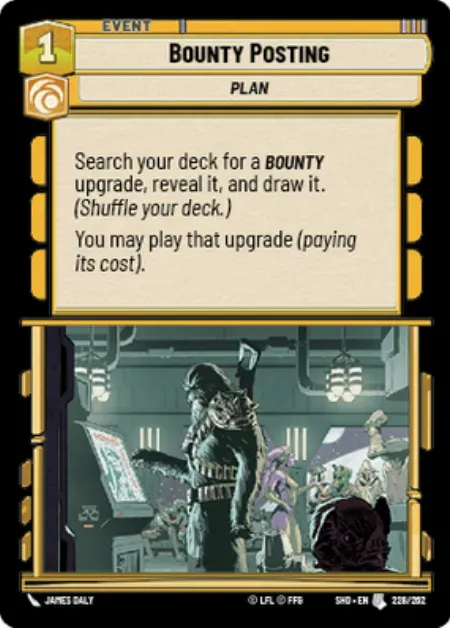
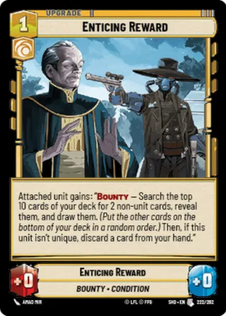
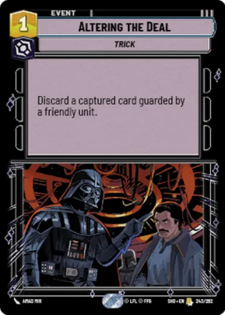
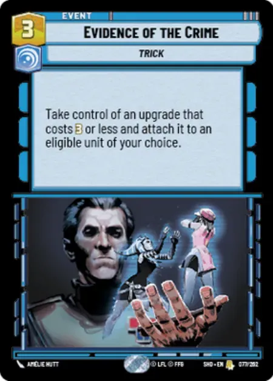

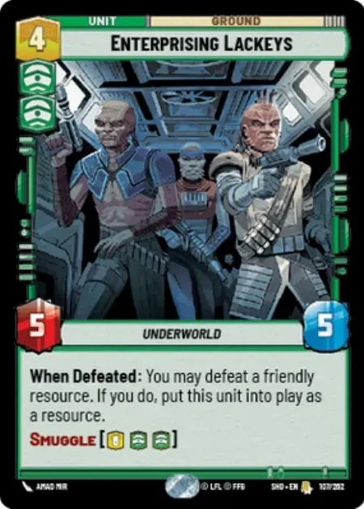

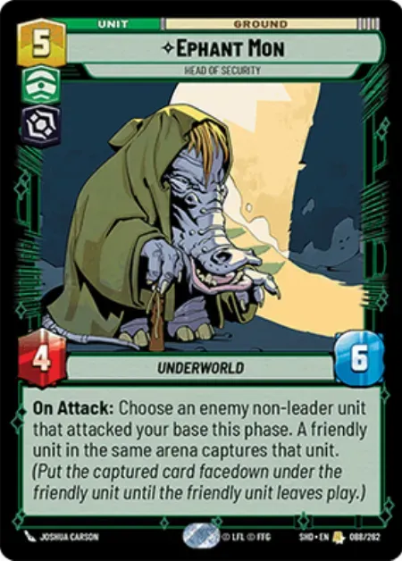

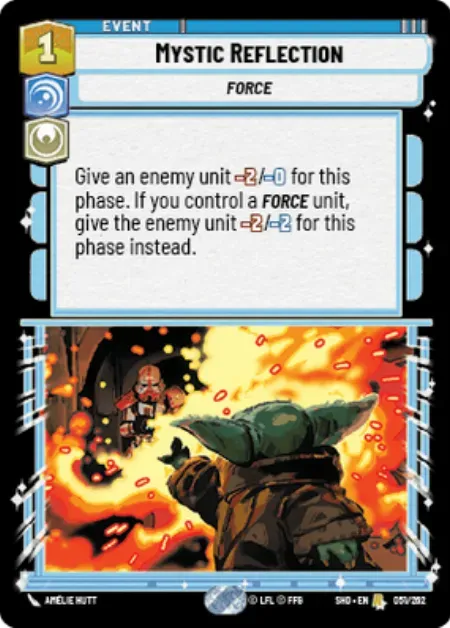
